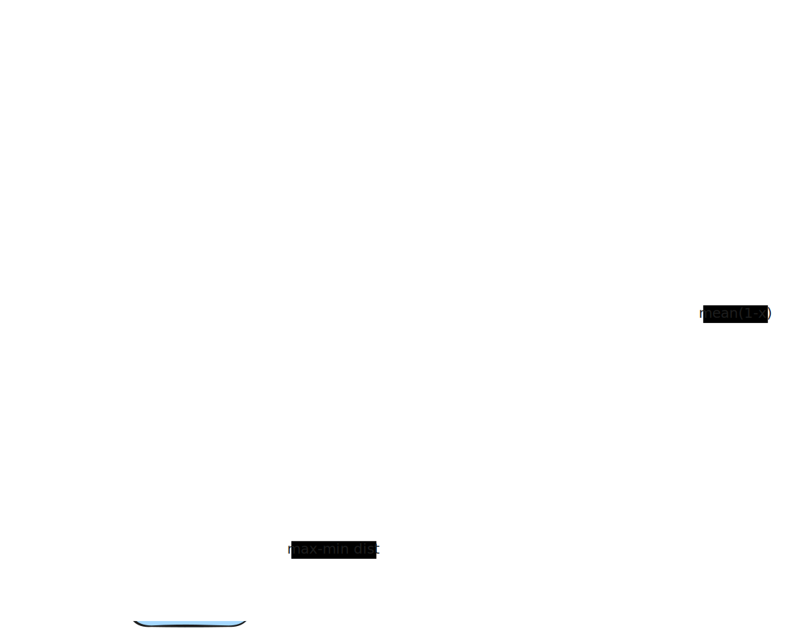

[AlphaEvolve](https://deepmind.google/discover/blog/alphaevolve-a-gemini-powered-coding-agent-for-designing-advanced-algorithms/) 已经发布三个月。在此之前，AlphaEvolve 已经伴随 Gemini 2.0 演进到 Gemini 2.5，在 Google 内部使用了一年，其中也许最大的贡献是回收了 Google 全球计算资源的 0.5%，通过优化 Borg 的一个计算调度优先级的启发式函数。对于 AlphaEvolve 的相关工作、架构、实验和带来的机会，我以后或许会补一篇 Part 0 来讨论，现在我们专注于复现。

到目前为止，开源社区最主流的复现工作是 [OpenEvolve](https://github.com/codelion/openevolve)。OpenEvolve 基本上按照 AlphaEvolve 白皮书宣称的架构和算法选型完成了开发，标志性的成果是在 Circle Packing 问题上复现了 AlphaEvolve 找到的新 SOTA 解。

OpenEvolve 的作者 Asankhaya Sharma 出色而且刻苦的工作一度让我放弃复现 AlphaEvolve。有这么一趟高速列车可以搭乘，何必自己重新造轮子。至于一些令人尴尬的实现细节（比如 OpenEvolve 最早使用 $\mathcal{O}(N^2)$ 的字符级别编辑距离来计算两个文件的相似度，这使得 100 行以上的程序的进化就慢得令人绝望）倒是小问题，自己维护一个分支就行。

然而，最近一个月，OpenEvolve 的开发工作趋于停滞，产能集中在更多示例和漂亮的 README。README 里一度宣称「began as a faithful implementation of AlphaEvolve and has evolved far beyond it」。稍等一下，OpenEvolve 还有一个我最期待、也是最根本的功能没有完成吧？那就是整代码库进化。

谈及这点，其实 AlphaEvolve 也有点左右脑互搏。AlphaEvolve 的博客里明确地写道「AlphaEvolve is an agent that can go beyond single function discovery to evolve entire **codebases** and develop much more complex algorithms」，尽管论文里的和 [FunSearch](https://deepmind.google/discover/blog/funsearch-making-new-discoveries-in-mathematical-sciences-using-large-language-models/) 对比的表格又说「evolves entire code **file**」。考虑到「evolves entire code file」本质上和「evolves single function」没什么差别，我推测 AlphaEvolve 的论文可能是在不同时期写就，或者纯属笔误。无论如何，以 Google 的实力，就算 AlphaEvolve 一开始没有整代码库进化的能力，在 Gemini 2.5 出来后又演进了这么久，现在也该有了。

整代码库进化是一个巨大的范式转变，只有支持这个功能才能区分于 FunSearch，并极大提升实用性。正好，最近几个月的思考沉淀出了一些灵感，我 fork 了一个[分支](https://github.com/NeapolitanIcecream/openevolve/tree/Sol)，着手实现这个功能。

要实现整代码库进化，我们需要把 OpenEvolve 这种组装 prompt -> 产生改进解的一问一答的模式改写成常见的 **agentic** 模式，类似 Cursor，提供一些工具，让模型在给定的工具循环预算内探索、理解和修改整个代码库。而要让 OpenEvolve 变成一个 code agent，需要回答的最主要的问题是：此时进化数据库中的**个体**是什么？

不卖关子，我想到的答案是 **commit**。Commit 满足作为进化个体所需的一系列性质：存在父代-子代关系，有一个 LLM 可读的表达形式，容易计算 MAP-Elites 所需的 feature，比如 diversity 等。虽然还有其他很多（并且可以自己发明一些）表达代码库级别渐进变化的形式，但是通过将 commit 作为进化个体，我们可以复用我们最常用的一套设施：git。这带来两方面的好处：

1. 复用最主流的版本管理、diff 生成等能力，而不是自己造轮子（然后修一大堆 bug）；
2. 模型进化 commit 形成的 git 历史为进化过程提供了天然的可解释性，人类通过 review git 历史来理解进化过程，而不是把后者作为一个黑箱。

OpenEvolve 里的 MAP-Elits 有两个预设的特征维度：complexity 和 diversity。Complexity 是直接 `len(file)` 得到的，我们有样学样，清洗一下 diff 后也搞个 `len(diff)`。至于 Diversity，OpenEvolve（如我们上面所说的）一开始用字符级别编辑距离来计算，后来发现太慢了，改为代码长度、行数和字符集差异。这仍然很奇怪，我们很容易构造出代码长度相近、行数和字符集相同，但是功能完全不同的程序。无论如何，我们考虑用如下图所示的方法计算 commit 的 diversity：

Root commit 是进化的起点，current commit 是我们正在为其计算特征的那个个体。我们从 git 历史清洗出 root commit（不包括）到 current commit（包括）的 diff，这个 diff 比用来组装 prompt 的那个更规范化，然后分成多个相互重叠的块，minhash 得到签名，两个签名 Jaccard 得到相似度。维护一个参考集，这个参考集是贪心地尽可能选取互不相似的签名得到的。对于要计算 diversity 的个体，令它的签名分别与参考集中的元素计算相似度，取 `(1 - similarity)` 的均值作为 diversity。

这个做法的好处是快，所有可怕的复杂度因子基本上没有相乘关系，而且：

1. 相似的个体算出来的相似度确实高，不会因为微小扰动而被认为非常不相似；
2. 不相似的个体算出来的相似度确实低，不会出现功能完全不同的程序被认为相似的情况。

It just works。也许我们以后会改成更复杂的算法或者讲更吸引人的故事，不过现在能跑就行。

改好了进化数据库，我们就有了 code agent 的雏形：

这部分没什么好说的，基本上重写了全部代码来使项目工作在 agentic 模式下，并提供了一个 submit 工具来控制迭代结束，维护 git 数据（将工作结果保存为一个新的 branch 上的一个新的 commit）并将改动提交到 evaluator。我从 Gemini CLI 抄了一些我认为最基本的工具，不过最后还是改了很多代码，因为我对 Gemini API 和生态（.gemini_ignore 等设计）兼容不感兴趣，和用户确认相关的逻辑也没什么用。唯一值得注意的是怎么**并行**。复用 git 生态的好处再次体现，我们直接用 git worktree 提供隔离和并行度，这样每个迭代都有一个独立的工作环境。

7 月的时候 Manus 发了一遍讨论 context engineering 的 know-how 的 [blog](https://manus.im/blog/Context-Engineering-for-AI-Agents-Lessons-from-Building-Manus)，特别有启发意义。Blog 已经写得够明白的了，网上也有很多很好的解读，比如 boj 的这篇 [blog](https://01.me/2025/07/context-engineering/)，我就不废话了。这促使我思考在这个场景上也相信并利用模型的长上下文能力能否也取得收益。无论如何，这是一个值得做的实验。在设计 agentic 基础设施时，我将这一点也纳入考量，现在每个 worker 会有一个持久的会话，历史迭代产生的数据都在上下文里，并保持前缀稳定。Worker 不共享会话历史，而是通过进化数据库软同步。会话由几个参数控制自动压缩，并使用一些 prefill 和保留最近迭代数据的小技巧：

也是抄 Gemini CLI 的 :D。

最近几个月还有很多 attention-based 的管理 context 的技术涌现出来，以后我也会考虑用上，不过现在还是能跑就行。

现在我们有了所有主要的 fancy 的特性：commit 作为进化个体，agent 改动整个仓库，长上下文支持。OpenEvolve 现在可以被期待工作得远超一开始的设计，接近 AlphaEvolve 并寻求青出于蓝而胜于蓝的机会。

不过现在的代码写得很烂，也没有经过实验。[接下来](https://github.com/NeapolitanIcecream/openevolve/tree/Merc)可预期地是一段漫长的修 bug 的日子，还会有一些零零碎碎的新的机制设计，还有实验环境的设计。这些内容会在开发过程中酝酿出本文的 Part 2。不过 Part 2 不会包含实验本身。我计划在 Part 3 讨论实验内容和结果，以及反哺出的设计。这样就让静态的改进留在 Part 2，动态的改进留在 Part 3。我希望 Part 3 在合规范围还包含一些在真实商用场景中的实践经验，不过这个要看缘分。
